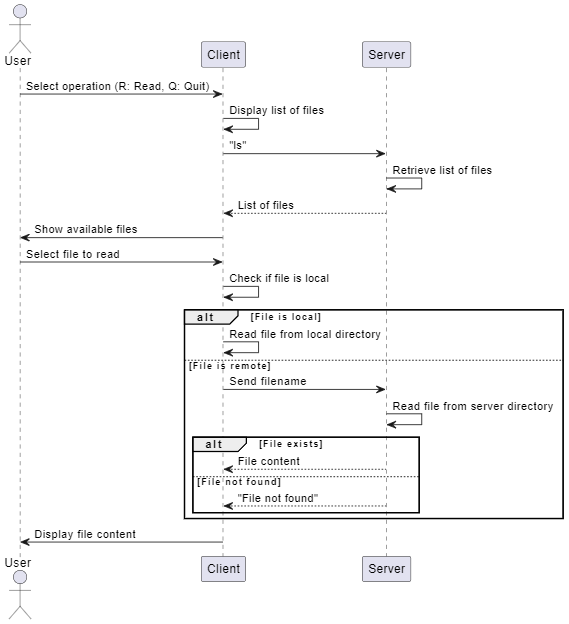

# Lab 2 - Socketserver file system

The project is set up with a simple client-server architecture. The user uses the client to see available files. From the user's point of view they are all stored at the same location, but behind the hood the files can either be stored locally or on a remote server. The user is presented with a list of the available files and can choose to view the content of one. When it requests a file, the client first tries to find it locally. If it is not there, it requests the file from the server. They communcaite via sockets. If client and server have a file with the same name, the client will always choose the local one.



## How to run

To run the app open a terminal and navigate to the project folder. Then run the following commands:

```bash
cd server
python server.py
```

Then, open a new terminal, navigate to the project folder and run the following commands:

```bash
cd client
python client.py
```

This terminal now works as a interface for the user
